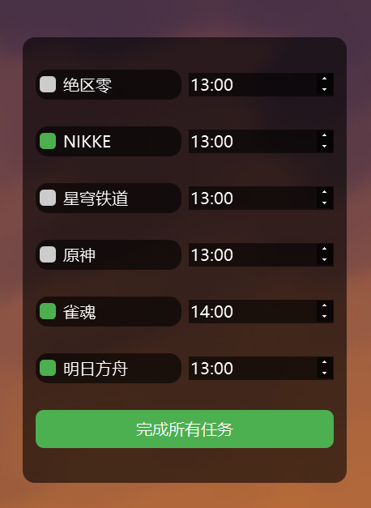

# DesktopReminder

自用的手游日常提醒列表

## 预览截图

## 功能介绍
这是一个很小众的软件，只满足某些非常特定的需求，比如跨时区的手游玩家。
主要功能是创建一个提醒列表，点击勾选框可以标记完成，并且会**每天**在设定的时间刷新重置。

本软件的窗口会保持在Windows系统桌面之上，其他程序之下。win+D快捷键也会让本程序最小化，点击托盘图标可以重新显示。

如果有什么功能需求可以在issue提，如果也恰好符合我的需求我会考虑加上。

## 使用方法
请直接下载release中的或者dist中的exe文件。
请放置于一个单独的目录，初次运行会生成tasks.json文件。本程序可移动(Portable)，无需安装，无需管理员权限，但是开机自启动功能使用了用户级别的注册表，取消勾选“开机启动”即可删除该注册表。

右下角的系统托盘图标左键单击可以召唤/隐藏窗口，右键单击可以设置开机启动和退出。

为了保持界面简洁，我把编辑功能全部移除，所以需要直接编辑tasks.json来改变列表内容。格式请根据模板和本仓库源代码中的样例自行感受，初次运行只需要填写**任务名称**和**重置时间**即可。

没有进行夏令时适配，所以对于夏令时国家的用户，每年都要手动调整时间两次，这该死的仪式感。

## 其它
本程序可能会作为未来的手游脚本集成自动维护项目的一个控制台，也可能不会。

其实时间栏可以直接编辑。

